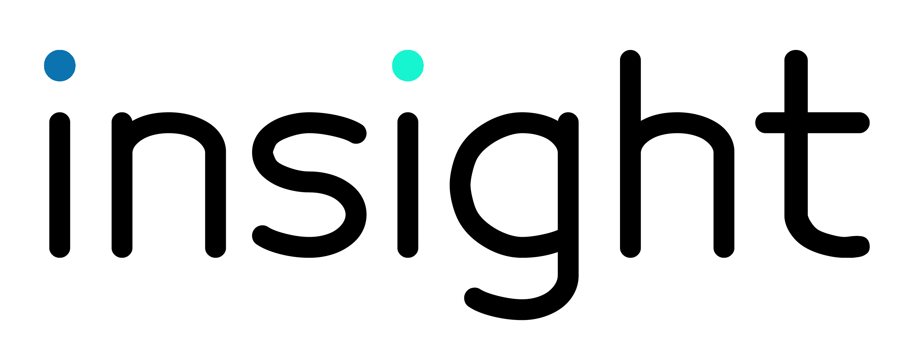
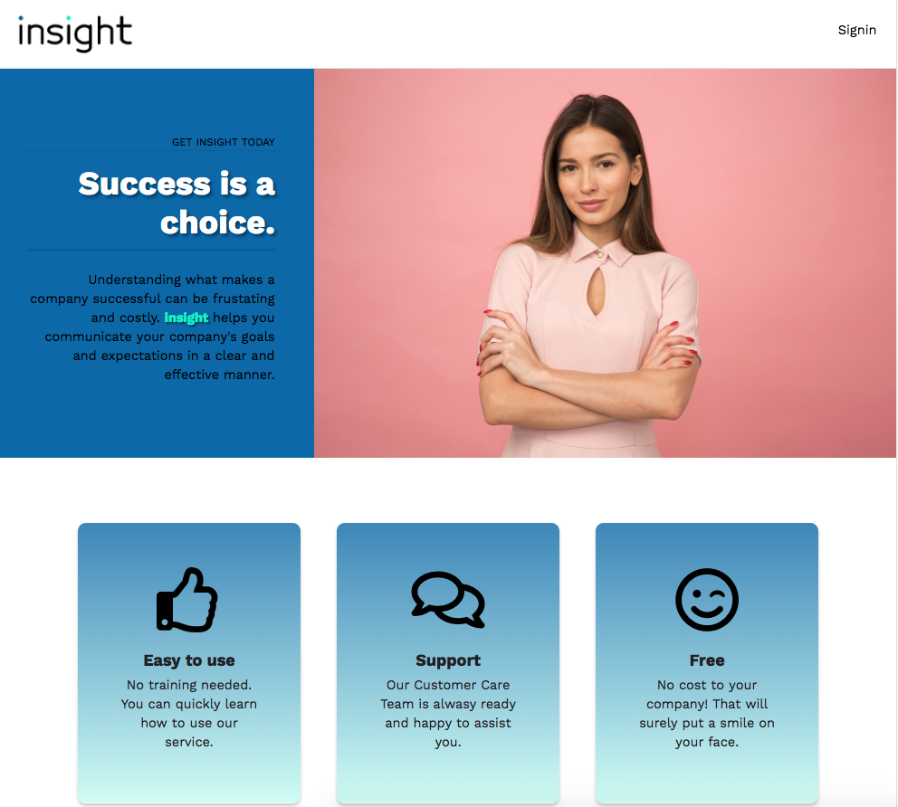
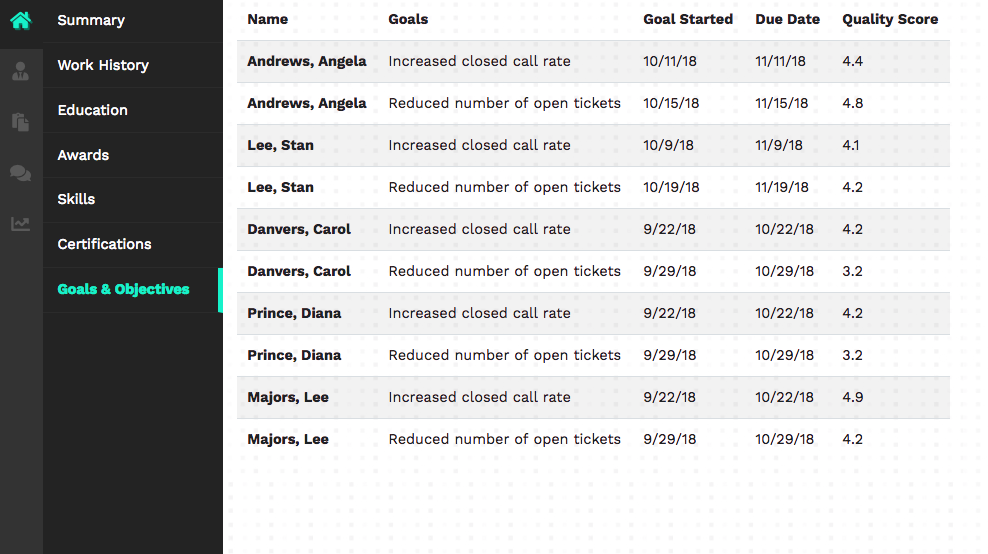
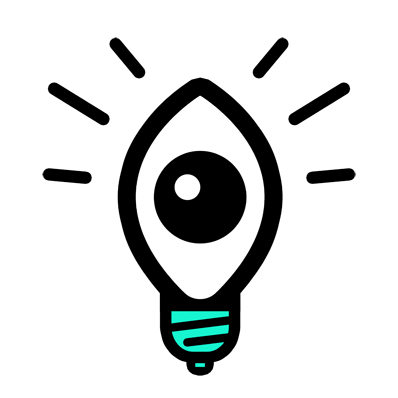

# Insight ~ Employee Management System
[Insight](https://getinsight.app/) is an open source application that was created to solve the problem of employees not getting the much needed guidence and feeback they deserve and supervisors inability to write SMART goals for their team to follow. This app provides the much needed feedback loop to get everyone on the same page, moving the organization forward. 

# Table of Contents

# Motivation
The idea for this app stemed from a brainstroming session between the team members, [Angela Andrews](https://github.com/angela-andrews), [Megan Anthony](https://github.com/angela-andrews), [Guillermo Barila](https://github.com/gui365) and [Dan Gross](https://github.com/DanielWGross). Employees sometimes find that there are few channels for feedback and communication between them and the employer/supervisor. This one way channel of communcation is likened to a waterfall, from the top down. Insight offers employees the opportunity to give feedback to supervisors on how they're doing. These exchanges work two-fold. Supervisors can set goals for employees using S.M.A.R.T goals. So no more guessing where you stand or what is expected of you. Next, employees can review the goals and edit, amend or deny the goals and provide comments to help both parties to work together to establish goal, set expectations and provide ongoing feedback all year round. Not just waiting for the annual performance review to *tell* you how you're doing. Insight is the way to keep the conversation going and to measure everyones progress along the way. 

# How It Works

## Supervisors:
Supervisors can log in and view all of their employees. They can add employees demographic information as well as their department and position information, skills, education and most importantly, goals and objectives. 
## Employees:
Employees can log in and view only their informaton. Goals and objectives, education, skills badges, and awards given to them for a job well done.

# Usage
This application is useful for the small business owner who, 1) Wants to set goals and objectvies for their staff 2) keep track of personal information 3) track employee progress towards those goals and 4) allow employees to review how their manager is doing their jobs and provide suggestions on ways to improve as a manger.

# Config
Downl

# Technologies Used
 - HTML/CSS
 - Bootstrap
 - Font Awesome
 - JavaScript
 - Node.js
 - Express
 - React
 - GraphGL
 - Mongo
 - Mongoose
 - Passport Authentication
 - Netlify

# How to Contribute
Please read the [Code of Conduct](codeofconduct.md) for details, and the process for submitting pull requests to us.

# License
Insight is licensed under the terms of the GPL Open Source license and is available for free.

# Links
[Insight](https://getinsight.app/)

# Contributors
- [Angela Andrews](https://github.com/angela-andrews)
- [Megan Anthony](https://github.com/angela-andrews)
- [Guillermo Barila](https://github.com/gui365)
- [Dan Gross](https://github.com/DanielWGross)

